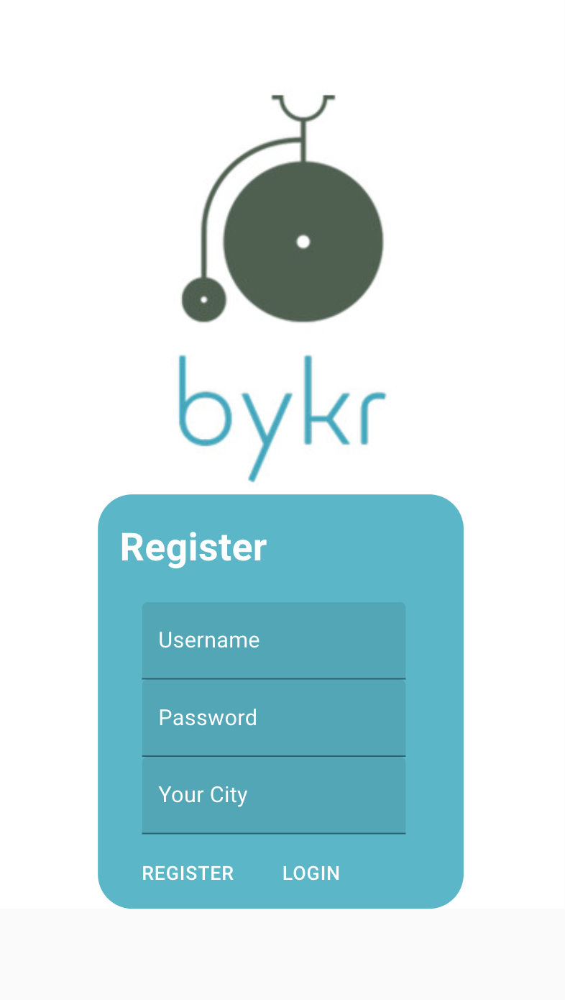
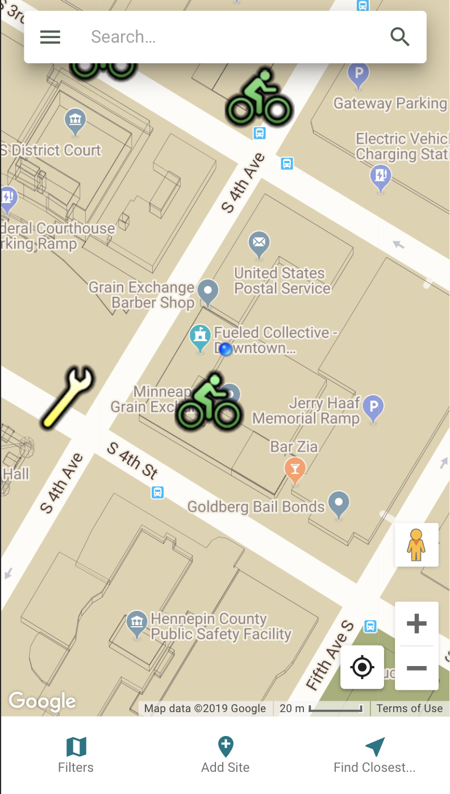
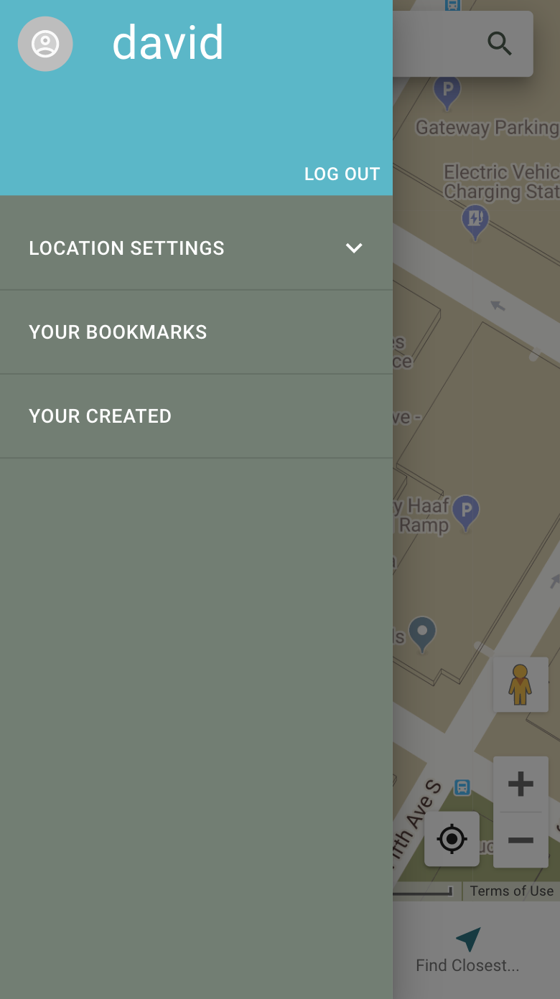
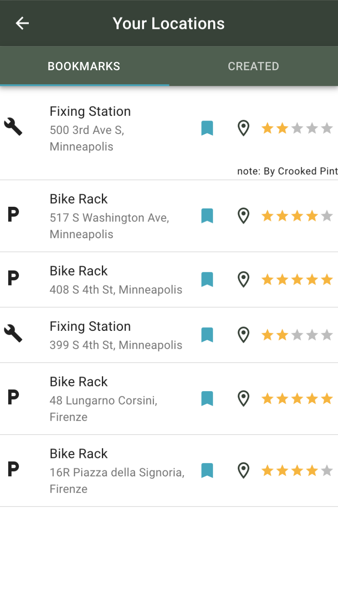

# BYKR

A mobile-first web-app designed to provide cyclists with tools for crowd-sourcing locations and quality ratings of bike racks, fixing posts, or other resources around town -- as well as finding nearby NiceRide biking docks.

## Built With

React, Redux, Redux-Sagas, PostgreSQL, NodeJS, Material-UI, Google Maps API, @react-google-maps/api library, and the GBFS (General Bikeshare Feed Specification) API.

## Getting Started

### Prerequisites

Link to software that is required before you attempt to start the app (e.g. node, mongo).

- [Node.js](https://nodejs.org/en/)
- [Google Maps API](https://developers.google.com/maps/documentation) key - you'll need to create a billing account and get a key with access to maps and geocoding

### Installing

1. Download the zip from the link in this repo.

2. Use the included database.sql file to create your database tables in a database called 'bykr_app'.

3. Create a .env file with your own server_session_secret and react_app_api_key for the google maps api.

4. Run the following commands:
   `npm install`
   `npm run server`
   `npm run client`

## Screen Shot

## Documentation

[Original Scope Document](https://docs.google.com/document/d/1EnITs38FqMzLMWod7-p37NZTVav1kF1KsTYefyoshWw/edit?usp=sharing)

### Next Steps

Features that you would like to add at some point in the future.

- [ ] Directions to location
- [ ] New Location types - mechanics, etc
- [ ] Ability to search for other pre-existing locations such as bike shops or coffee shops or breweries

## Authors

- David Heisel

## Acknowledgments

- Thanks to Prime Digital Academy for providing me with the tools and knowledge to build this!
- Thanks to the [North American Bike Share Association](https://nabsa.net/opendata/) for the General BikeShare Feed Specification - read their documention on their [Github](https://github.com/NABSA/gbfs)
